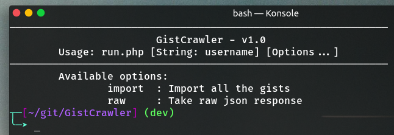

# GistCrawler
Gist Crawler is a PHP CLI tool to crawl all gist and its information by using a single line of command.
  
It's quite fast for downloading the gist file, but it works synchronously. Since PHP does not have asynchronous or parallel things natively, we plan to use another language in the future.

## Features
* Fully functional short command.
* Filtering option available.
* Callback on every event triggered.  

## Requirements
* PHP Version: > 7.0
* Internet access (of course).

## Previe and Usage
**Interface  view**


**Command usage**
```bash
# Import / download the gist(s).
php run.php <username> import

# Raw JSON Response
php run.php <username> raw

# Handle stdout to result.json
php run.php <username> raw > result.json
```

## Configuration
There are two available configurations that you can changes.  
TODO